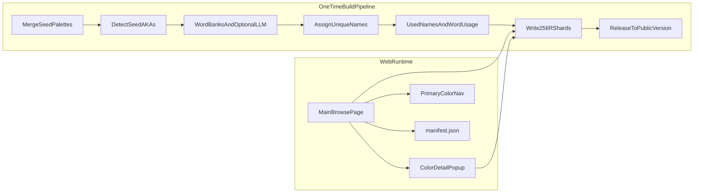
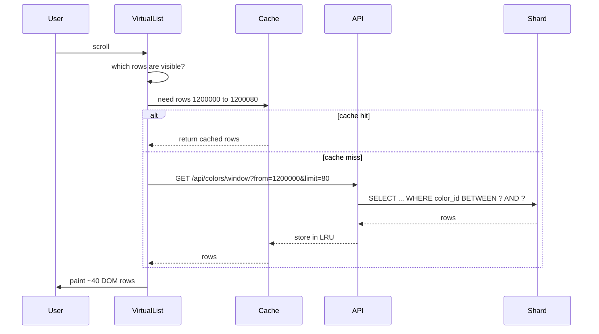

# everyColorNamed — Implementation Plan

> **Project:** everyColorNamed — a catalog of every RGB color with a static, unique, human-readable name.  
> **Laravel app:** `everyColorNamed/` · **Herd URL:** [http://everycolornamed.test](http://everycolornamed.test)  
> Last updated: 2026-07-11.

## Status

- [x] Laravel Artisan: import open palettes into `merged.json` with source tags
- [x] Seed-level AKA detection + cross-source name conflict resolution + report commands
- [x] Initial word banks (materials / nature / feelings) in `data/seeds/word_banks.json`
- [x] Versioned static naming with unique-name registry, progress bar, naming stats
- [x] Level 0 catalog build (~39k seeds) + shard storage + `browse.sqlite` index
- [x] Laravel JSON API: manifest, window (offset-based), color detail
- [x] `colors:release` command for public semver versions
- [x] Nuxt browse UI with virtual scroll, jump nav, popup, hover prefetch
- [x] Level 5+ catalog builds and level 10 full 16.7M (level 10 draft: `20260712-202146-90c8`, 16,777,216 colors)

---

## Goal

A web app that lists every RGB color with a **static, pre-generated, unique name** (never two colors share a name). Names are built once in a versioned pipeline, stored in sharded SQLite files, and browsed through a single performant main page with virtual scrolling. Color details open in a **popup modal** on that page for v1 (no separate indexed show-page routes). Shareable links use query params (`?hex=ff6347`) on the same page.

---

## Catalog levels (0–10)

We target the **full 16.7M catalog** (level 10). Lower levels use the **same shard architecture** as a fallback if builds or UI testing need a smaller dataset.

Every RGB color is `(R, G, B)` where each channel is `0–255`.

For levels 1–10, we sample on a grid: only values `0, step, 2×step, …` per channel (always include 255).

| Level | What it contains | Step | Approx. count | Use case |
|-------|------------------|------|---------------|----------|
| **0** | Seed colors only (imported named colors) | — | ~5,000–15,000 | Test naming + AKA on real names |
| **1** | Sparse grid | 128 | 8 | Smoke test |
| **2** | Sparse grid | 64 | 64 | Pipeline sanity check |
| **3** | Sparse grid | 32 | 512 | Fast UI iteration |
| **4** | Sparse grid | 16 | 4,096 | Virtual scroll basics |
| **5** | Medium grid | 8 | 32,768 | **Recommended starting point for UI dev** |
| **6** | Medium-dense | 4 | 262,144 | Stress-test prefetch across shards |
| **7** | Dense | 2 | 2,097,152 | Near-full density |
| **8** | Full RGB, half by rule | 1* | 8,388,608 | Intermediate full pass (even `color_id` only) |
| **9** | Full RGB, three-quarter | 1* | 12,582,912 | Intermediate full pass (color_id % 4 != 3) |
| **10** | **Every RGB value** | 1 | **16,777,216** | Production catalog |

\*Levels 8–9 are optional intermediate full-resolution subsets if level 7 → 10 jump is too heavy; same schema, fewer rows.

**Manifest field (draft):** `"build_id": "20260711-143022-a3f9", "status": "draft", "catalog_level": 10`



---

## Existing color databases (open sources only)

There is **no public dataset that names all 16.7M RGB values**. We import open palettes as **seeds** and **word-bank inspiration**, then assign every catalog color a unique static name in the build pipeline.

### Primary bulk import (start here)

Instead of importing dozens of lists one-by-one, **`meodai/color-names`** is the best single starting point:

| Source | ~Count | License | URL |
|--------|--------|---------|-----|
| **meodai/color-names** (full list) | ~31,900 | MIT | [github.com/meodai/color-names](https://github.com/meodai/color-names) |

It already merges XKCD, Wikipedia, CSS, Werner's, Wada Sanzo, Crayola (Wikipedia), NTC, OS X Crayons, htmlcsscolor.com, cultural lists (Japanese/Chinese/Thai), military paint names, community submissions, and more — with deduping and quality curation.

**Import strategy:** run `colors:import-seeds` against the full `color-names` JSON **plus** individual lists from `color-name-lists` for provenance tags (so AKA reports show "CSS" vs "XKCD" vs "Crayola" separately even when meodai merged them).

Optional API for spot-checking during dev (not for bulk 16M build): [api.color.pizza](https://github.com/meodai/color-name-api)

### Individual lists (for provenance / AKA tags)

Already in plan via [meodai/color-name-lists](https://github.com/meodai/color-name-lists):

| Source | ~Count | Notes |
|--------|--------|-------|
| **XKCD** | 954 | Survey-based human names |
| **CSS/HTML** | 148 | W3C standard |
| **X11** | ~750 | Standard |
| **NTC.js** | ~1,500 | Aggregated open names |
| **Wikipedia color names** | ~800+ | Community |
| **RAL** | ~200+ | European industrial standard names |
| **Le Corbusier** | 63 | Architectural system |
| **Traditional Colors of Japan** | ~450 | Cultural/historical |
| **Traditional Colors of China** | varies | Forbidden City aesthetics list |
| **Wada Sanzo** | ~300+ | Japanese color dictionary |
| **Werner's Nomenclature** | ~110 | 18th-century naturalist book (public domain) |
| **Robert Ridgway** | ~1,100+ | 1912 US public-domain nomenclature |
| **OS X Crayons** | ~50 | Apple color-picker names |
| **Microsoft Windows** | ~140 | Legacy system UI colors |
| **ISCC–NBS (Universal Color Language)** | vocabulary + patches | Modifier words and systematic names (public domain) |

### Additional sources worth adding

These are **not** fully covered by the plan table above but are good candidates:

| Source | ~Count | Best use | Notes / URL |
|--------|--------|----------|-------------|
| **Crayola crayon colors** | ~200+ | Seeds + playful names | Wikipedia list; names like "Macaroni and Cheese". [Wikipedia](https://en.wikipedia.org/wiki/List_of_Crayola_crayon_colors) |
| **The Color Thesaurus** (Ingrid Sundberg) | ~400+ | **Word bank gold** — evocative writer's names | [ingridsnotes.wordpress.com](https://ingridsnotes.wordpress.com/2014/02/04/the-color-thesaurus/) — materials/feelings buckets, not just hex seeds |
| **NBS / ISCC color patches** | ~267 | Seeds + systematic naming | Public-domain US gov nomenclature via [MIT Color Dictionaries](https://people.csail.mit.edu/jaffer/Color/Dictionaries) |
| **Resene** | ~1,380 | Seeds | Not Pantone — Resene permits copy/redistribute with copyright notice in file header. [resenecolours.txt](https://people.csail.mit.edu/jaffer/Color/resenecolours.txt) |
| **Tailwind CSS palette** | ~242 | Weak seeds, OK for hue-family labels | Open; names are functional (`slate-500`) — low priority |
| **Material Design / Google palettes** | ~100+ | Hue family reference | Open; mostly "Blue 500" style — low priority |
| **Open Color** | 12×10 steps | Not really names | Hex scales only — skip for seeds |
| **htmlcsscolor.com** | large | Already inside meodai/color-names | Extra provenance tag if imported separately |
| **Cultural / niche lists** (in meodai) | small | Flavor + word banks | Japanese Twelve Level Cap and Rank, Thailand weekday colors, Chinese heavenly creatures, Olympian god colors, military paint names |
| **Community submissions** (meodai GitHub) | thousands | Long-tail human names | Already in full list; high quality bar from maintainers |

### MIT Color Dictionaries hub

[people.csail.mit.edu/jaffer/Color](https://people.csail.mit.edu/jaffer/Color/Dictionaries) aggregates several named lists with **per-file licenses** (read each header):

| List | ~Count | Verdict |
|------|--------|---------|
| **NBS/ISCC** | ~275 | Use — public-domain systematic names |
| **Resene** | ~1,383 | Use — redistribution allowed with notice |
| **Winsor & Newton** | ~300 | Caution — paint brand list; check file license header before import |
| **Paul Tol** | ~72 | Use — academic visualization palette, open |

### Word-bank-only sources (no hex, or hex optional)

These feed **materials / feelings / nature** buckets rather than seed matching:

- **ISCC–NBS modifier vocabulary** — Pale, Deep, Grayish, etc.
- **The Color Thesaurus** — cherry, merlot, butterscotch as words tied loosely to hues
- **Seed name tokens** — decompose imported names ("Dusty Rose" → prefix + base for bank expansion)
- **LLM bucket expansion** — when collision stats say a hue bucket is word-poor (see Naming model)

### Sources we explicitly skip

- **Pantone** and unofficial Pantone hex tables
- **Sherwin-Williams, Benjamin Moore, Behr**, and other trademarked paint retail catalogs (unless you obtain explicit license)
- **Risograph colors list** — includes Pantone cross-refs in source data; skip or strip Pantone fields
- **Scraped brand APIs** without clear licensing
- **Wikipedia scrape-at-large** beyond maintained lists (use curated exports like meodai/wikipedia-color-names instead)

### Import priority order

1. `meodai/color-names` full JSON (~31k) — bulk seeds
2. Individual `color-name-lists` entries — provenance / AKA source tags
3. Resene + Ridgway + NBS from MIT hub — fills gaps meodai may have merged away
4. Color Thesaurus — word banks JSON (may need manual CSV conversion)
5. Crayola Wikipedia — explicit provenance for crayon-specific AKAs
6. LLM word expansion — only after collision stats from first build

---

## AKA (also-known-as) — how it works and where it lives

AKA is **not** computed at browse time. It comes from **how we store seed data**, separate from the 16M catalog names.

There are **three different collision types** across imported sources. They are handled differently:

| Collision type | Example | Handled how |
|----------------|---------|-------------|
| **Same hex, different names** | CSS `cyan` and `aqua` both → `#00FFFF` | AKA aliases on one seed entry |
| **Same name, different hex** | CSS `maroon` → `#800000`, Resene `maroon` → `#800000` vs another source's `#B03060` | **Canonical owner** picks one hex; others get `conflicting_names` |
| **Catalog uniqueness** | Two of 16M colors would share generated name "Copper Haze" | `used_names` registry at build time — unrelated to seed import |

---

### Cross-source collisions: same name, different hex (the "Maroon" problem)

Different datasets often reuse the same English word for **different** RGB values. CSS Maroon is `#800000`. Another list may call a slightly different red "Maroon" too.

**Rule: one name → one canonical hex in our system.** Only that hex may use the name as its catalog/seed primary name. Every other hex that a source labeled with that name keeps the attribution as history, but does **not** steal the name.

#### Step 1 — Collect all raw rows at import

Every source row becomes:

```json
{ "hex": "800000", "name": "Maroon", "source": "CSS", "source_priority": 10 }
{ "hex": "b03060", "name": "Maroon", "source": "Resene", "source_priority": 40 }
```

`source_priority` is a fixed deterministic ranking (lower = wins):

| Priority | Source |
|----------|--------|
| 10 | CSS / HTML / W3C |
| 20 | X11 |
| 30 | NTC.js |
| 40 | XKCD |
| 50 | Resene, Ridgway, NBS |
| 60 | Crayola (Wikipedia) |
| 70 | meodai community / other |
| 80 | Color Thesaurus (word-bank-only rows may have no hex) |

#### Step 2 — Group by hex first (same-hex AKA)

Same as before: all names for `#800000` land on one seed entry's `aliases` array.

#### Step 3 — Resolve same-name / different-hex

For each normalized name (case-insensitive, trimmed — `"Maroon"` = `"maroon"`):

1. Find all `{ hex, source }` rows that used this name.
2. If only **one hex** → that hex **owns** the name (add to its `owned_names` list).
3. If **multiple hexes** → pick **canonical hex**:
   - Highest-priority source (lowest `source_priority` number) wins.
   - Tie on priority → lowest hex value wins (deterministic).
4. **Canonical hex** seed entry:
   - `primary_name` may be `"Maroon"` if that is the winning name for this hex (also subject to same-hex alias rules).
   - `owned_names: ["Maroon"]` — names this hex is the official owner of.
5. **Non-canonical hexes** that a source also called `"Maroon"`:
   - Do **not** use `"Maroon"` as `primary_name` or catalog name.
   - Store under `conflicting_names`:

```json
{
  "hex": "B03060",
  "primary_name": "…",
  "conflicting_names": [
    {
      "name": "Maroon",
      "source": "Resene",
      "canonical_hex": "800000",
      "canonical_source": "CSS"
    }
  ]
}
```

**Popup for `#B03060`:** catalog name is generated (e.g. "Deep Ember"). Below that:

> **Source note:** Called "Maroon" in Resene — canonical Maroon in this catalog is `#800000` (CSS).

**Popup for `#800000`:**

> **Name:** Maroon  
> **Also known as:** … (same-hex AKAs only)

This is **not** an AKA — it is a **disputed / non-canonical attribution**. AKA remains strictly "other names for **this same** hex."

#### Worked example: Maroon

| Source | Hex | Name |
|--------|-----|------|
| CSS | `#800000` | Maroon |
| X11 | `#800000` | maroon |
| Resene | `#800000` | maroon (same hex — merges into aliases, no conflict) |
| Resene | `#B03060` | maroon (different hex — conflict) |

Result:

- `#800000` → `primary_name: "Maroon"`, aliases include X11/Resene variants for same hex
- `#B03060` → `conflicting_names: [{ name: "Maroon", source: "Resene", canonical_hex: "800000" }]`, gets a generated catalog name

#### Step 4 — `colors:report-name-conflicts` command

Human-readable report of every name claimed by 2+ hexes:

```
Maroon
  CANONICAL  #800000  CSS
  CONFLICT   #B03060  Resene
```

Review optional; rules are deterministic so rebuilds match.

---

### Two different storage layers

```
seeds/merged.json     ← source of truth for AKA + canonical name ownership (import time)
shards/rXX.sqlite     ← one unique display name per color (build time)
```

**Layer 1 — Seed file (`merged.json`):** one entry per unique hex:

```json
{
  "hex": "00FFFF",
  "primary_name": "Aqua",
  "owned_names": ["Aqua", "Cyan"],
  "aliases": [
    { "name": "Cyan", "source": "CSS" },
    { "name": "Aqua", "source": "HTML" }
  ],
  "conflicting_names": []
}
```

**Same-hex AKA detection** (during import):

1. Normalize every imported row to `#RRGGBB`.
2. Group rows with the **same hex** → collect all names into `aliases`.
3. Pick `primary_name` from aliases using source priority, then alphabetical tie-break.

**Layer 2 — Catalog shards:** every color gets exactly **one** unique `name`. When assigning:

- If hex matches a seed and the seed **owns** a one-word name (e.g. Maroon on `#800000`) and ΔE < 2 → catalog name is `"Maroon"`.
- If hex has `conflicting_names` but does not own the name → use word-bank generated name; show `conflicting_names` in popup as source notes.
- If hex is near but not exact to a seed → generated name only; `nearest_seed_*` fields for reference.

When a catalog color's hex **exactly matches** a seed hex with no conflict, the popup shows AKA:

> **Name:** Aqua  
> **Also known as:** Cyan (CSS), Aqua (HTML)

When a catalog color is **near** a seed but not exact, we store `nearest_seed_hex` and `nearest_seed_name` separately — we do **not** copy seed AKA onto it automatically.

### Why this split matters

- **AKA** = multiple names for the **same hex** (all sources agree on the RGB, disagree on the word).
- **Conflicting names** = same word used for **different hexes** in the wild; we pick one canonical owner.
- **Catalog name** = our app's unique label for this specific RGB; only the canonical hex gets to use a disputed word like "Maroon" as its display name.
- A nearby color `#FF6348` gets its **own** unique generated name (e.g. "Coral Sand") — not "Tomato 2".

---

## Glossary — math and storage concepts

### `color_id` and `R << 16` (bit packing)

Each color needs a single integer ID for sorting and shard lookup. We pack R, G, B into one number:

```
color_id = (R × 65536) + (G × 256) + B
```

`R << 16` is shorthand for "shift R left by 16 bits" = multiply R by 65536. Same idea as writing a phone number as one integer instead of three separate fields.

Examples:

| R | G | B | Hex | color_id |
|---|---|---|-----|----------|
| 0 | 0 | 0 | #000000 | 0 |
| 255 | 255 | 255 | #FFFFFF | 16,777,215 |
| 255 | 99 | 71 | #FF6347 | 16,744,263 |

**Why:** one number sorts in the same order as nested loops `for R, for G, for B` — perfect for infinite scroll. Also tells us which shard file to open (see R-shard below).

Reverse: `R = color_id >> 16`, `G = (color_id >> 8) & 255`, `B = color_id & 255`.

---

### R and R-shard — what they mean

**R** is the red channel of an RGB color (0–255). In our storage layout, **R is also the shard key**.

An **R-shard** is one SQLite file containing **all catalog colors that share the same R value**, with every combination of G and B:

- Shard `r00.sqlite` → all colors where R=0 (G and B each 0–255 → 65,536 colors at level 10)
- Shard `r01.sqlite` → all colors where R=1
- …
- Shard `rff.sqlite` → all colors where R=255

**Why shard by R:** the list is sorted by `color_id`, which loops G and B fastest and R slowest — so consecutive scroll windows usually hit **one shard at a time**, minimizing file opens during scroll. There are exactly **256 R-shards** (R is one byte: 0x00–0xFF).

**Example:** color `#FF6347` has R=255, G=99, B=71 → lives in shard `rff.sqlite`, at `color_id = 16744263`.

When the browse API needs rows 16,744,200–16,744,280, it opens `rff.sqlite` once and runs a range query — no need to touch the other 255 files.

---

### RGB vs CIELAB — why not compare raw R,G,B?

**RGB** is how monitors store color (three 0–255 channels). It is **bad for "how similar do two colors look?"** because human eyes do not treat R, G, B equally. Two colors can be far apart in RGB but look nearly identical, or close in RGB but look very different.

**CIELAB (Lab)** converts RGB into three values designed to match human perception:

- **L** = lightness (0 = black, 100 = white)
- **a** = green ↔ red axis
- **b** = blue ↔ yellow axis

Two colors that **look** similar will have similar Lab values even if their RGB numbers differ a lot.

We convert RGB → Lab **once during the build** (never in the browser for every scroll frame). Stored Lab values help naming and nearest-seed lookup.

---

### Delta E (ΔE) — "how different do two colors look?"

**Delta E** is a single number measuring perceptual distance between two Lab colors.

| ΔE | Rough meaning |
|----|---------------|
| 0 | Identical to the eye |
| 1–2 | Nearly identical; experts might notice |
| 2–5 | Similar; casual viewer may not notice |
| 5–10 | Clearly related but different |
| 10+ | Obviously different colors |

**Why we use it:** to decide if a catalog color is close enough to a seed to **keep the seed's exact name** (ΔE < ~2) vs needing a new associative name. Also stored on each row as `delta_e` to the nearest seed for the popup.

---

### k-d tree — fast "find nearest seed color"

With ~5,000–15,000 seed colors, checking every seed for every catalog color (16M × 15k) is too slow.

A **k-d tree** is a search structure that partitions color space (in Lab coordinates) so "find nearest point" takes roughly **log(n)** steps instead of scanning all seeds. Built once during `colors:build-index`, saved to disk, used during catalog generation.

**Analogy:** like a phone book organized by region then street, not a flat list — you narrow down quickly instead of reading every entry.

---

### B-tree and SQLite — how lookup works (we don't build this manually)

When we create:

```sql
CREATE TABLE colors (
  color_id INTEGER PRIMARY KEY,
  ...
);
```

SQLite automatically builds a **B-tree index** on `color_id`. A B-tree is a balanced tree where each node points to a range of keys — finding `color_id = 16744263` touches only a few tree levels (~3–4 for 65k rows per shard), not a full table scan.

**We do not implement B-trees ourselves.** We choose the right column as `PRIMARY KEY` or `CREATE INDEX`, and SQLite handles fast:

- Point lookup: `WHERE hex = 'ff6347'` (with index on hex if added)
- Range scan for scroll: `WHERE color_id BETWEEN 1200000 AND 1200080 ORDER BY color_id`

Each shard is ~65,536 rows at level 10 — well within SQLite's comfort zone.

---

## Naming model (static, unique, not seed-heavy)

### Hard rules

1. **Every color gets exactly one name** in the catalog — globally unique across all 16.7M rows.
2. **No numbers in names** — never "Warm Coral 2".
3. **No live generation** — names assigned once per build in the pipeline.
4. **Prefer fewer words** — shortest valid name wins. If a seed already has a one-word name (e.g. "Tomato", "Sage"), use that single word on exact/near-exact match (ΔE < 2). Only add prefix/suffix when needed for uniqueness or when the base candidate collides.
5. **Exact seed match** uses the seed's primary name as-is (respecting its word count).
6. **Versioned** — see [Build vs public versioning](#build-vs-public-versioning) below; names can change between draft builds; public releases are frozen.

### Global unique-name registry (mandatory pipeline check)

During catalog generation, maintain a **`used_names` registry** (SQLite table or hash set on disk):

```
When assigning a candidate name to color_id X:
  1. Normalize: lowercase, trim, collapse spaces
  2. IF name in used_names → reject, try next candidate
  3. ELSE → insert into used_names, write to shard row
```

At end of build: assert `COUNT(distinct name) == COUNT(rows)`. Build fails if any duplicate slips through.

### Word usage counters and collision stats

To avoid repetitive naming and detect when word banks are too small, the pipeline tracks usage during generation:

**`word_usage` registry** (SQLite, per build):

| Column | Purpose |
|--------|---------|
| `word` | Single token (base, prefix, or suffix) |
| `word_type` | `base`, `prefix`, `suffix`, `seed` |
| `hue_bucket` | Which bucket it was used in (nullable for global modifiers) |
| `use_count` | How many color names include this word |

**Collision stats** (written to `data/builds/{build_id}/naming_report.json`):

- `total_collisions` — how many times a candidate name was rejected as duplicate
- `collisions_by_hue_bucket` — which buckets run out of words fastest
- `avg_name_word_count` — track whether we are staying short
- `top_overused_words` — words appearing in >N names (signal to expand bank)
- `collision_rate` — collisions / total colors; if high, word bank is too thin

**`colors:report-naming-stats`** command prints a summary after build. Use this to decide whether to run LLM word expansion or manually add words to a bucket.

### Naming strategy — associative word banks, prefer short names

**Step 1 — Classify the color** (from precomputed Lab/HSL):

- Nearest **basic hue bucket**: Red, Orange, Yellow, Green, Cyan, Blue, Purple, Pink, Brown, Gray, White, Black
- Lightness band: Pale, Light, Medium, Deep, Dark
- Saturation band: Muted, Soft, Vivid, Electric

**Step 2 — Try shortest name first** (deterministic candidate order):

1. **One word:** seed primary name if ΔE < 2 and seed name is one word
2. **One word:** `word_bank[hue_bucket][color_id % bank_length]` (base only)
3. **Two words:** `{prefix} {base}` OR `{base} {suffix}` — try prefix-first, then suffix-only if shorter reads better
4. **Three words:** only if steps 1–3 all collide — `{prefix} {base} {suffix}`

Never skip straight to three words if a one- or two-word option is available and unique.

**Step 3 — Word banks** (materials, nature, feelings — per hue bucket):

| Bank type | Examples |
|-----------|----------|
| Materials | Clay, Slate, Linen, Copper, Frost, Ember, Moss, Pearl |
| Nature | Dusk, Tide, Harvest, Cedar, Bloom, Storm, Sage, Coral |
| Feelings/mood | Serene, Bold, Wistful, Warm, Bleak, Cozy, Haunting |

Base word selection: `word_bank[hue_bucket][color_id % bank_length]` — same color_id always picks the same starting word.

#### Future word bank categories (under consideration — not implemented yet)

Current **nature** words are mostly landscapes, weather, and plants (`Cedar`, `Bloom`, `Storm`) — not a dedicated produce or fauna list. Before adding more buckets, review collision stats (`naming_report.json`) at level 5+.

| Possible bucket | Example words | vs existing |
|-----------------|---------------|-------------|
| **Fruits** | Cherry, Plum, Apricot, Fig, Mango | Nature has some overlap (`Coral`, `Bloom`) but not food-specific |
| **Vegetables / herbs** | Sage, Basil, Kale, Pepper, Olive | `Sage`, `Basil` already in materials/nature — would move or duplicate carefully |
| **Animals** | Robin, Fox, Koi, Raven, Finch | Distinct from nature; good for vivid hue buckets |
| **Minerals / gems** | Opal, Garnet, Jasper, Onyx | Overlaps materials — could split `materials` into organic vs mineral |
| **Food / drink** | Honey, Cocoa, Wine, Cream, Toast | Evocative, short; overlaps materials (Cocoa, Honey already there) |
| **Fabrics / textiles** | Linen, Velvet, Denim, Silk | Overlaps materials heavily |

**Recommendation:** add **animals** and **fruits** first if stats show repetition — they are the most distinct from current buckets. Merge overlapping words (e.g. keep `Sage` in one bucket only). Use LLM `colors:expand-word-bank` per bucket when collision rate climbs, then human-review before merging into `word_banks.json`.

**Step 4 — Collision resolution** (still no numbers, still prefer shorter):

If candidate is taken, try in fixed order:

1. Next base word in same bank (still one word)
2. Add prefix only: `{prefix} {base}`
3. Add suffix only: `{base} {suffix}`
4. Add both prefix and suffix
5. Next base + prefix/suffix combinations
6. Last resort: alternate fallback word list (non-numeric) — still checked against `used_names`

Only **exact/near-exact seed matches** (ΔE < 2) use the seed name directly. Everything else pulls from word banks keyed to **hue bucket**, not seed name.

### LLM role — word bank expansion only (not per-color naming)

The LLM is **never** asked to name individual colors. It helps **expand the word banks** so we have enough variety across 16.7M rows.

**Task:** given a hue bucket (e.g. "Red"), existing words, and style guidelines, produce a list of similar-sounding materials, nature terms, moods, textures, etc. that fit that bucket.

```
colors:expand-word-bank --bucket=Red --count=500 [--llm]
```

**Determinism:**

1. LLM responses are **cached** keyed by `hash(bucket + prompt_version + model_id)` → `data/seeds/word_banks_llm_cache.json`
2. Temperature 0, pinned model ID in config
3. Human review optional before merging into `word_banks.json`
4. Actual color naming remains **100% rule-based** — LLM output only feeds the banks

**When to run:** when `naming_report.json` shows high `collision_rate` or `top_overused_words` in a bucket. The stats tell us if we are word-poor without guessing.

**Default v1:** hand-curated word banks + seed imports; LLM expansion is an optional pipeline step when stats say we need more words.

---

## Storage: sharded SQLite

```
data/
  seeds/                          # shared across builds — not version-specific
    merged.json
    word_banks.json
    word_banks_llm_cache.json
  builds/                         # draft / test builds — names can change freely
    {build_id}/                   # e.g. 20260711-143022-a3f9
      registry/
        used_names.sqlite
        word_usage.sqlite
      shards/
        r00.sqlite.gz … rff.sqlite.gz
      naming_report.json
      manifest.json               # status: "draft"
  releases/                       # finalized public catalogs only
    v1/
      shards/ …
      manifest.json               # status: "released", public_version: "1"
    v2/
      …
  current -> releases/v1/         # symlink or pointer file for deployed app
```

**Shard schema:**

```sql
CREATE TABLE colors (
  color_id        INTEGER PRIMARY KEY,
  r INTEGER, g INTEGER, b INTEGER,
  hex             TEXT NOT NULL UNIQUE,
  name            TEXT NOT NULL UNIQUE,
  hue_bucket      TEXT,
  text_contrast   TEXT NOT NULL,          -- 'light' or 'dark' (text color on swatch)
  nearest_seed_hex TEXT,
  nearest_seed_name TEXT,
  delta_e         REAL,
  l REAL, a REAL, b_lab REAL
);
CREATE INDEX idx_colors_name ON colors(name);
```

### Text contrast (`text_contrast`)

Each color stores whether **UI text on top of the swatch** should be light or dark. Computed once at build time from relative luminance (WCAG formula):

- Light text (`#FFFFFF`) on dark/medium backgrounds
- Dark text (`#1a1a1a`) on light backgrounds

Used on list rows, popup swatch, and nav so hex/name labels stay readable without per-row runtime calculation.

---

## Sorting — v1 vs future

### v1: sort by `color_id` only

Shards are written in **`color_id` ascending order** (R outer, G middle, B inner). Range queries like `WHERE color_id BETWEEN ? AND ?` are fast and sequential — perfect for virtual scroll.

This is the **only sort mode in v1**.

### Why shards don't support arbitrary sorts natively

Each R-shard is optimized for one physical order: `color_id`. To sort by name, hue, lightness, or random:

- You would need **separate index files or re-sorted shard copies** per sort mode, OR
- A full scan + sort in memory (impossible at 16M scale), OR
- A different storage layout (e.g. secondary SQLite indexes on `name`, `l`, `hue_bucket` — expensive to build and still slow for global random order)

### Future phase: alternate sort modes

| Sort | Approach | Phase |
|------|----------|-------|
| By `color_id` | Default — current shards | v1 |
| By hue bucket | Jump nav already jumps; optional filter-within-bucket | v2 |
| By name A–Z | Build secondary index shard set or `names.sqlite` lookup table | v2+ |
| By lightness | Precomputed `l` column + secondary sorted manifest of ranges | v2+ |
| Random | Seeded PRNG order in manifest (deterministic shuffle list of window offsets) — heavy | v3+ |

**Practical v2 candidate:** keep primary shards as-is; add optional **`sort_indexes/`** per release version built by a separate command that creates lightweight lookup files without rewriting 256 main shards.

---

## Build vs public versioning

Two separate version concepts:

### Build ID (internal, every pipeline run)

Every `colors:generate-catalog` run gets a **`build_id`** (timestamp + short hash), e.g. `20260711-143022-a3f9`.

- Output goes to `data/builds/{build_id}/`
- Names **can change** between builds — that's fine during development
- Manifest has `"status": "draft"` — no public version number yet
- Web dev server can point at latest draft build for testing

### Public version (assigned only at release)

A **public version** (semver: `1`, `2`, `3` …) is assigned only when you explicitly finalize a build for deployment:

```
colors:release {build_id} --public-version=1
```

This command:

1. Copies (or symlinks) `data/builds/{build_id}/` → `data/releases/v1/`
2. Sets manifest `"status": "released"`, `"public_version": "1"`
3. Updates `data/current` pointer to `releases/v1/`
4. Public version is **immutable** — never overwrite `v1/`; new names go in `v2/`

### URLs and version

| Environment | URL pattern | Notes |
|-------------|-------------|-------|
| Local dev | `/?hex=ff6347` | Uses latest draft build; version in UI footer optional |
| Public deployed | `/v/1?hex=ff6347` or `/?v=1&hex=ff6347` | Version in URL so shared links stay stable if v2 ships later |

When v2 releases, v1 URLs keep working (old names preserved). Default `/` can redirect to latest public version or show a version picker later.

### Manifest (released example)

```json
{
  "build_id": "20260711-143022-a3f9",
  "public_version": "1",
  "status": "released",
  "catalog_level": 10,
  "naming_strategy": "word_banks_v1",
  "total_colors": 16777216,
  "shard_count": 256,
  "jump_nav": { "Red": 8323072, "...": "..." }
}
```

---

## Tech stack

| Layer | Choice | Why |
|-------|--------|-----|
| **Build pipeline** | Laravel Artisan | Batch jobs, queues, comfortable for you |
| **Web app** | Nuxt 3 + Vue 3 + TypeScript | Vue familiarity + API routes for shard reads |
| **Virtual scroll** | `@tanstack/vue-virtual` | Windowed rendering, recycling rows |
| **Mobile (later)** | Expo | Same manifest + shard HTTP endpoints |

**v1 scope:** main browse page + popup detail on same page. Shareable `?hex=` (and `?v=` when released) query params. No separate indexed routes, no sitemap.

---

## Main browse page

### Layout (responsive)

```
┌──────────────────────────────────────────────────┐
│  Header (title, catalog version, search later)   │
├──────────┬───────────────────────────────────────┤
│ Primary  │                                       │
│ color    │   Virtual scroll list                 │
│ jump nav │   (swatch + name + hex per row)       │
│ (fixed)  │                                       │
│          │                                       │
│ Red      │                                       │
│ Orange   │                                       │
│ Yellow   │                                       │
│ …        │                                       │
└──────────┴───────────────────────────────────────┘
        ↑ desktop: side nav
        ↑ mobile: horizontal sticky top bar or collapsible drawer
```

### Primary color jump navigation

The list sorted by `color_id` starts at `#000000` — lots of near-black/dark rows before vibrant colors appear. **Jump nav** lets users skip ahead.

**Nav items (fixed order in UI):** `Black` first (since the list starts at black), then Gray, Brown, White, then chromatic hues:

```
Black → Gray → Brown → White → Red → Orange → Yellow → Green → Cyan → Blue → Purple → Pink
```

Precompute in manifest at build time from `browse.sqlite`: first row where each `hue_bucket` appears:

```json
"nav_order": ["Black", "Gray", "Brown", "White", "Red", "Orange", "Yellow", "Green", "Cyan", "Blue", "Purple", "Pink"],
"jump_nav": {
  "Black":  { "offset": 0,       "color_id": 0 },
  "Gray":   { "offset": 1234,    "color_id": 1381653 },
  "Red":    { "offset": 8901,    "color_id": 1708304 },
  "White":  { "offset": 38000,   "color_id": 15792383 }
}
```

Click **Black** → virtual list scrolls to `scrollTop = jump_nav.Black.offset × ROW_HEIGHT` (use **row offset**, not `color_id`, so sparse catalogs like level 0 work correctly). Prefetch that window on **hover** before click.

Nav is **fixed** (sticky sidebar on desktop, sticky top strip on mobile).

**Hover prefetch on nav items:** when the user **hovers** (or `touchstart` on mobile) a jump-nav button, immediately prefetch the window of rows around that `color_id` into the LRU cache — before the click fires. On click, scroll position updates and data is already warm → feels instant with no loading flash.

### Virtual scroll (recycling)

Only ~40–60 DOM rows exist at any time. As you scroll, row components **reuse** the same DOM nodes with new data — like a window sliding over a long tape.



**Parameters:**

- `ROW_HEIGHT`: fixed px (e.g. 72) — required so scroll position maps to index without measuring each row
- `OVERSCAN`: extra rows rendered just above/below viewport so fast scroll doesn't show blank gaps
- Max DOM nodes: ~40–60 regardless of 16M catalog size

### Pre-loading strategy — terms explained

**Pre-loading** = fetching data *before* the user scrolls to it, so rows appear instantly.

1. **On page load:** fetch tiny `manifest.json` + first window (rows 0–79).

2. **rAF (requestAnimationFrame):** browser API that runs code right before the next screen paint (~60 times/sec). We use it to **debounce scroll handling** — instead of firing 100 fetch requests during a fast flick, we wait until the next frame, read scroll position once, then decide what to load. Keeps scrolling smooth.

3. **LRU cache (Least Recently Used Map):** in-memory store of recently fetched row windows. Key = `floor(color_id / WINDOW_SIZE)`. When cache exceeds ~10 windows, **drop the oldest** (least recently scrolled near). Keeps memory ~50–100KB of JSON instead of 16M rows.

4. **Prefetch buffer:** when scroll position is within 2 viewport-heights of the cached edge, fetch the next window in the scroll direction *before* user arrives.

5. **AbortController:** if user scrolls down then quickly back up, cancel the in-flight fetch for the abandoned direction so stale data doesn't overwrite the cache.

6. **Nav hover prefetch:** on `mouseenter` / `touchstart` of a primary-color nav item, prefetch the row window at that item's `jump_nav` offset (same API as scroll prefetch). Complements scroll-based prefetch for jump navigation.

### What NOT to do

- Don't `v-for` over millions of items
- Don't load full catalog into JavaScript memory
- Don't compute names in the browser

### Optional stretch goals (explained)

**Image swatches:** some color apps render each row as a tiny PNG/image file instead of a CSS `background-color` div. Useful for patterns, textures, or export — **not needed for v1**. We use CSS color squares (zero network cost).

**Web Worker for JSON parsing:** when a shard window returns ~80 rows of JSON, `JSON.parse()` runs on the main thread and can cause a 5–20ms jank frame. A **Web Worker** is a background thread that parses JSON and returns plain objects, keeping scroll animation on the main thread smooth. Optional optimization after basics work; skip initially.

**`content-visibility: auto`:** CSS hint telling the browser it can skip layout work for off-screen rows. Safety net alongside virtual scroll.

---

## Color detail popup (v1 — same page, shareable URL)

Click a row → modal overlay on the main page. **No separate route or indexed page** — avoids sitemap/SEO concerns for 16M URLs.

### Shareable links via query params

The popup state syncs to the URL without navigation:

- Dev: `/?hex=ff6347`
- Released: `/v/1?hex=ff6347` or `/?v=1&hex=ff6347`

Opening a shared link loads the browse page and auto-opens the popup for that hex. Use `<meta name="robots" content="noindex">` on the app or rely on single-page URL fragments/query-only patterns so search engines don't index individual colors.

**Future:** optional dedicated `/color/ff6347` routes with `noindex` if share UX needs cleaner URLs — deferred.

### Popup contents

- Large swatch (CSS background) with correct `text_contrast` text
- Name, hex, RGB, HSL, Lab values
- **AKA block** (if hex matches a seed in `merged.json`)
- Nearest seed name + ΔE (if not exact match)
- Copy buttons
- Close clears `?hex=` from URL; prev/next within loaded window (full prev/next across 16M deferred)

---

## Build pipeline (Laravel Artisan)

1. `colors:import-seeds` — open palettes → `merged.json` + alias groups + canonical name ownership
2. `colors:report-aliases` — human-readable report of hexes with 2+ names (same hex)
3. `colors:report-name-conflicts` — report of names claimed by 2+ hexes (e.g. Maroon → #800000 vs #B03060)
4. `colors:expand-word-bank` — optional LLM-assisted bucket word expansion (cached, not per-color)
5. `colors:build-index` — k-d tree of seeds in Lab space
6. `colors:generate-catalog --level=5` — assign unique names, registries, shards → `data/builds/{build_id}/`
7. `colors:report-naming-stats` — collision counts, word usage, overused words
8. `colors:build-manifest` — checksums, jump nav offsets, draft manifest
9. `colors:verify-unique` — assert zero duplicate names across all shards
10. `colors:release {build_id} --public-version=1` — promote draft to `data/releases/v1/` (manual, when ready for public)

Lower levels for fallback; level 10 when ready (parallelize by R-shard, queue workers).

### Progress indicator (`colors:generate-catalog`)

Long builds must never look frozen. The generate command outputs:

- **Console progress bar** — overall % and current R-shard (e.g. `Shard 142/256 (r8e) — 1,842,000/16,777,216 colors — 11% — ETA 2h 14m`)
- **Per-shard log line** when each R-shard completes
- **`build_progress.json`** in build dir — updated every N colors so a separate `colors:progress` command or CI can poll it
- **Laravel `$this->output->progressStart()` / `progressAdvance()`** or `symfony/progress-bar` for terminal UX

When running via queue (256 jobs), a summary command aggregates job completion counts from cache/Redis.

---

## Repo structure

```
color/
├── PLAN.md
├── everyColorNamed/          # Laravel — pipeline + JSON API (Herd: everycolornamed.test)
│   app/Console/Commands/
│   app/Services/Color/
│   routes/api.php
├── web/                      # Nuxt 3 (not started)
├── data/
│   seeds/
│   builds/{build_id}/        # shards/, browse.sqlite, manifest.json
│   releases/v1/, v2/, …
│   current                   # pointer to active build id
└── README.md
```

---

## Implementation phases

### Phase 1 — Seeds + alias report
- Import open palettes (no trademark sources)
- AKA report from exact hex grouping
- Curate word banks; optional LLM bucket expansion

### Phase 2 — Naming engine + level 5 build
- Lab conversion, k-d tree, unique-name + word-usage registries
- Short-name preference, collision stats report, progress bar on generate
- Verify determinism: rebuild twice → identical output

### Phase 3 — Main browse page (core learning)
- TanStack Virtual + responsive layout
- Fixed primary-color jump nav with hover prefetch
- LRU prefetch + rAF scroll debounce
- Popup with `?hex=` URL sync, `text_contrast` on rows

### Phase 4 — Release workflow + level 10
- `colors:release` command, versioned URLs (`/v/1?hex=…`)
- Overnight level 10 parallel R-shard build
- gzip + deploy `data/releases/v1/` to CDN/static host

### Phase 5 — Later
- Alternate sort indexes (name, lightness)
- Dedicated show-page routes (still noindex) if needed
- Expo mobile app

---

## Risks and mitigations

| Risk | Mitigation |
|------|------------|
| Duplicate names | Global `used_names` registry; build fails on duplicate; `colors:verify-unique` |
| Repetitive names / word poverty | `word_usage` counters + `naming_report.json` collision stats; expand banks via LLM or manual |
| Names too long | Prefer shortest valid candidate; seed one-word names kept as one word |
| Scroll jank | Virtual list + fixed row height + rAF + prefetch + nav hover prefetch |
| White/black scroll fatigue | Primary color jump nav with precomputed offsets |
| Level 10 build time | Parallel 256 R-shards via queue workers; progress bar + `build_progress.json` |
| Draft vs public name churn | Draft builds in `builds/`; public semver only via `colors:release` |
| LLM non-determinism | LLM only expands word banks; cached by bucket+prompt; naming stays rule-based |
| Unreadable text on swatches | Precomputed `text_contrast` per color at build time |
| Alternate sorts at scale | v1 color_id only; future secondary index files — see Sorting section |

---

## Decisions captured

- **Target:** level 10 full catalog; levels 0–9 as fallback ladder
- **Sources:** open only; no Pantone / trademark catalogs
- **Names:** globally unique, no numbers, prefer short names (one word when possible), word-bank associative naming with prefix + suffix only when needed
- **LLM:** expands word banks per hue bucket only — never names individual colors
- **Word health:** collision stats + per-word usage counters drive bank expansion
- **AKA:** seed-file only, exact hex grouping at import time
- **Versioning:** draft `build_id` for testing; public semver via `colors:release`; version in URL when deployed
- **Storage:** `data/builds/` for drafts, `data/releases/vN/` for immutable public catalogs
- **Sort:** `color_id` only in v1; alternate sorts are a future phase requiring separate indexes
- **v1 UI:** main browse page + popup with `?hex=` share links; no indexed show pages
- **Contrast:** `text_contrast` (light/dark) precomputed per color
- **Prefetch:** scroll window + nav hover prefetch
- **Start UI dev at level 5** (~33k colors) once naming pipeline works at level 0–1
